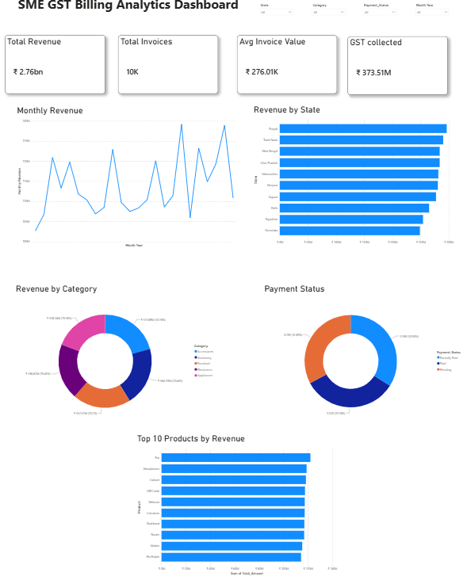
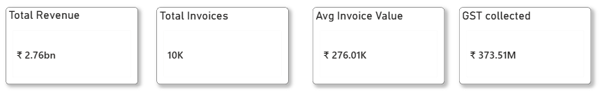
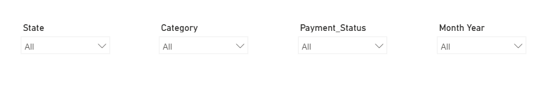
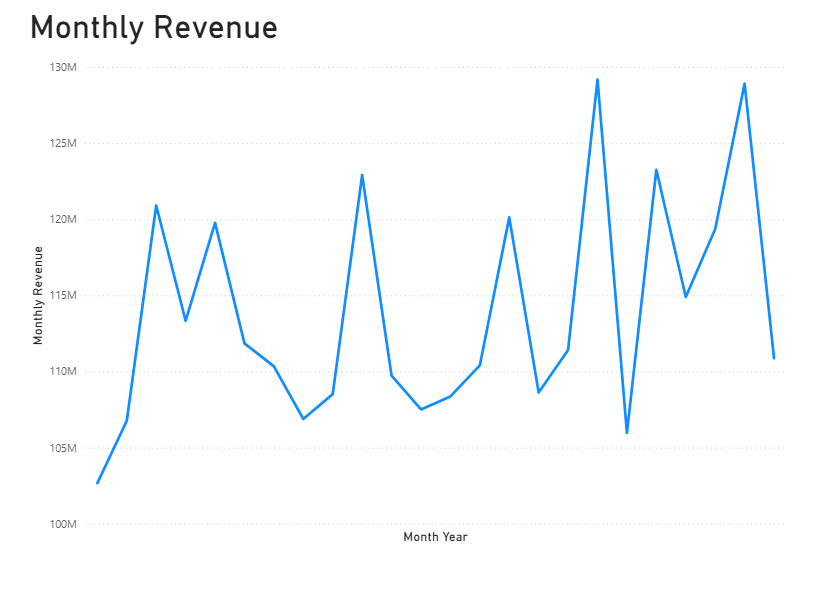
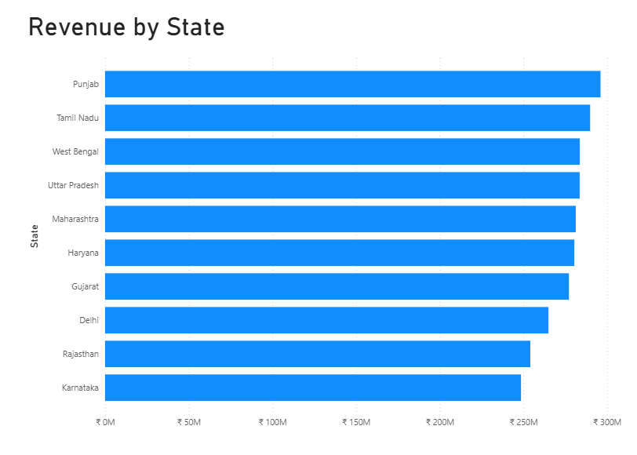
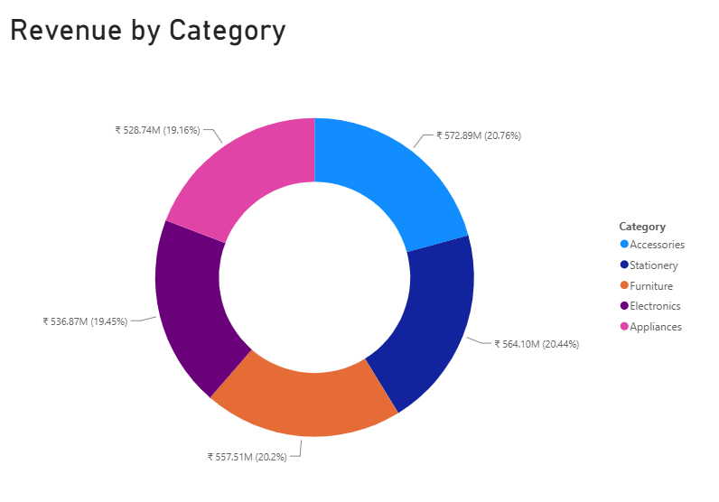
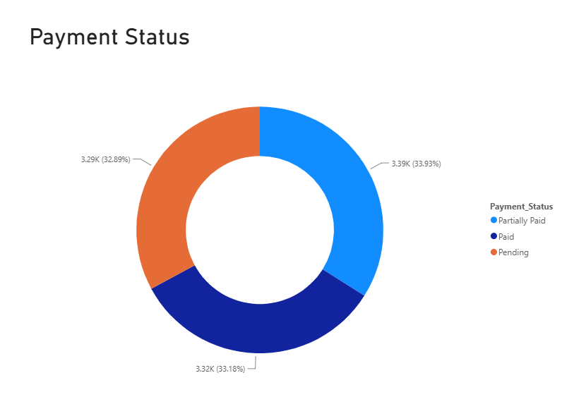
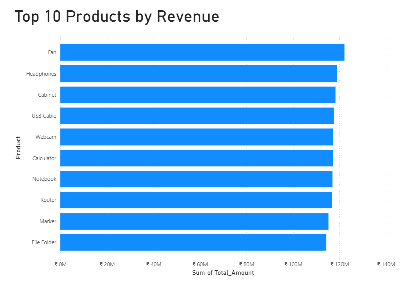

# SME GST Billing Analytics

## Project Overview

SME GST Billing Analytics is an end-to-end data analytics project built to analyze invoice-level billing data, revenue performance, GST collection, customer transactions, payment status, product performance, and regional sales.

The project combines **MySQL for data storage and analysis** with **Power BI for interactive business reporting and visualization**.

---

## Business Problem

Businesses generate large volumes of invoice data, but raw transaction records do not directly provide actionable insights.

This project aims to answer key business questions such as:

- What is the overall revenue generated?
- How much GST has been collected?
- Which states generate the highest revenue?
- Which product categories contribute the most revenue?
- Which products are the top revenue generators?
- How does revenue change month by month?
- What is the distribution of payment statuses?
- What is the average invoice value?

---

## Dataset

The project uses a generated SME GST billing dataset containing:

- **10,000 invoices**
- Invoice dates
- Customer information
- Product information
- Product categories
- Quantity
- Unit price
- Discount percentage
- GST rate
- CGST
- SGST
- IGST
- Total invoice amount
- Payment method
- Payment status
- Salesperson
- State

---

## Tools & Technologies

### Database & SQL
- MySQL
- MySQL Workbench
- SQL
- Aggregations
- GROUP BY
- CASE statements
- Date-based analysis
- Views
- Indexing

### Data Visualization
- Microsoft Power BI
- DAX
- Interactive slicers
- KPI cards
- Line charts
- Bar charts
- Donut charts

---

## SQL Analysis

The MySQL database was created using the `sme_billing_gst` schema.

The project includes SQL analysis for:

- Revenue analysis
- GST analysis
- Monthly revenue trends
- State-wise revenue
- Category-wise revenue
- Product performance
- Payment status analysis
- Invoice-level analysis

A `Monthly_Sales` SQL view was also created to summarize monthly revenue.

An index was created on `Invoice_Date` to support date-based queries.

---

## Power BI Dashboard

The Power BI dashboard provides an interactive overview of the billing data.

### KPI Metrics

- **Total Revenue:** ₹2.76B
- **Total Invoices:** 10K
- **Average Invoice Value:** ₹276.01K
- **Total GST Collected:** ₹373.51M

### Interactive Slicers

The dashboard includes:

- State
- Category
- Payment Status
- Month Year

### Visualizations

The dashboard contains:

1. Monthly Revenue
2. Revenue by State
3. Revenue by Category
4. Payment Status
5. Top 10 Products by Revenue

---

## Key Insights

### Revenue Performance

Total revenue across the dataset is approximately **₹2.76 billion**, generated from 10,000 invoices.

The average invoice value is approximately **₹276.01K**.

### State-wise Revenue

Punjab has the highest revenue among the states shown in the dashboard, followed by Tamil Nadu and West Bengal.

### Category Performance

Accessories represent the largest category revenue share at approximately **20.76%**, followed by Stationery, Furniture, Electronics, and Appliances.

### Monthly Revenue

Monthly revenue remains broadly within the **₹100M–₹130M range**, with several noticeable peaks and dips across the period.

### Payment Status

Payment statuses are relatively balanced:

- Partially Paid: ~33.93%
- Paid: ~33.18%
- Pending: ~32.89%

This indicates that the dataset contains a relatively even distribution of payment states.

### Product Performance

The Top 10 Products analysis identifies the highest revenue-generating products, with **Fan** appearing as the leading product in the dashboard.

---

## Dashboard Preview



### KPI Cards



### Dashboard Slicers



### Monthly Revenue



### Revenue by State



### Revenue by Category



### Payment Status



### Top 10 Products by Revenue



---

## Project Structure

```text
SME-GST-Billing-Analytics/
│
├── SQL/
│   └── gst_billing_analysis.sql
│
├── PowerBI/
│   └── SME_GST_Billing_Dashboard.pbix
│
├── Screenshots/
│   ├── dashboard_overview.png
│   ├── kpi_cards.png
│   ├── dashboard_slicers.png
│   ├── monthly_revenue.png
│   ├── revenue_by_state.png
│   ├── revenue_by_category.png
│   ├── payment_status.png
│   └── top_10_products.png
│
└── README.md